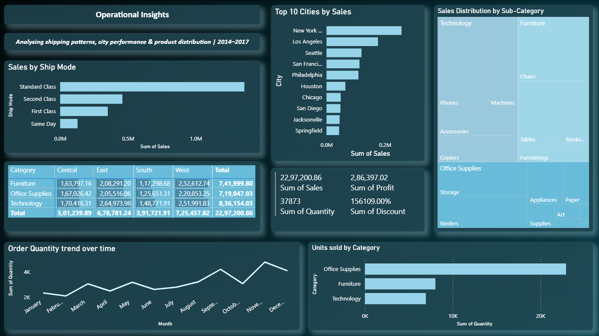
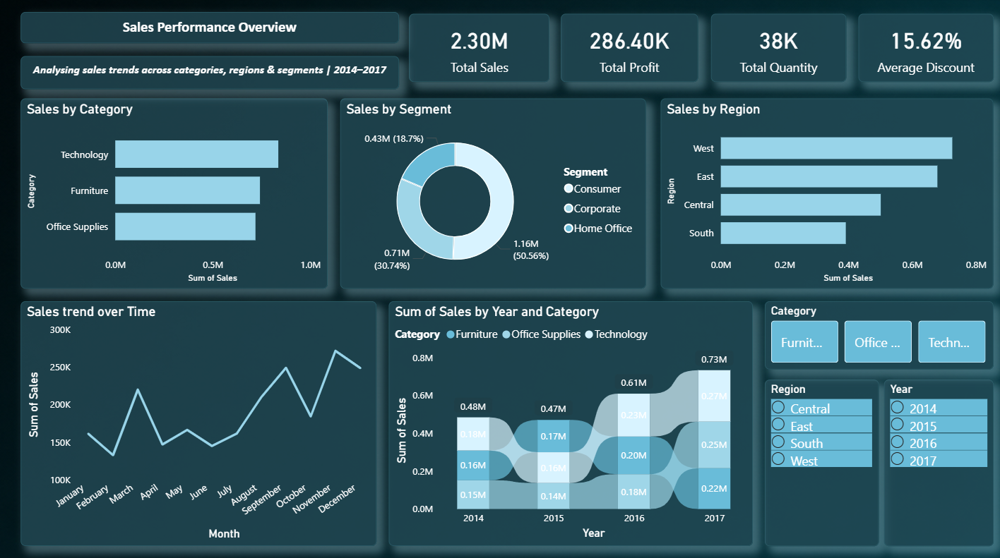
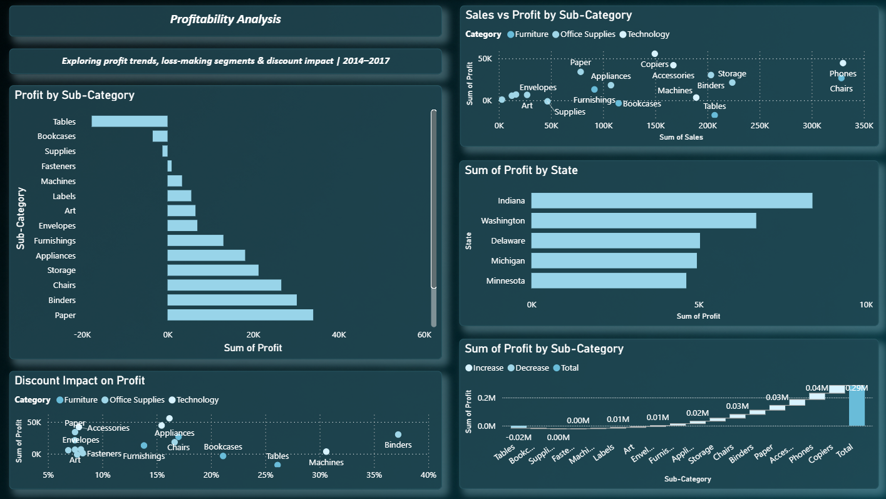

# Sales-Performance-PowerBI-Dashboard
An interactive 3-page Power BI dashboard analysing  sales, profitability and operational insights from  the Sample Superstore dataset (9,994 rows | 2014–2017)
This project enables stakeholders to monitor sales performance, profitability, customer behavior, and regional trends through dynamic visualizations and KPI-driven reporting.

The dashboard leverages Power Query for data preparation, DAX for advanced calculations, and an optimized Star Schema data model to deliver high-performance analytics suitable for business decision-making.

# Project Overview
Organizations generate vast amounts of sales data every day, but without proper analysis, valuable insights often remain hidden.

This Power BI dashboard addresses that challenge by providing a centralized analytical platform to monitor:

-  Sales Performance
-  Profitability Analysis
-  Regional Performance
-  Customer Segment Analysis
-  Product Category Performance
-  Time-Based Sales Trends
-  Executive KPIs

The dashboard allows decision-makers to quickly identify growth opportunities, monitor business performance, and make data-driven strategic decisions.

# Objectives
The primary objectives of this project are to:
- Analyze overall business sales performance.
- Evaluate profitability across different regions and product categories.
- Identify top-performing customer segments.
- Monitor key business KPIs.
- Enable interactive exploration through filters and slicers.
- Support strategic business planning with data-driven insights.

# Technology Stack

Tool                                      Purpose 
Microsoft Power BI                 Dashboard Development & Visualization 
Power Query                        Data Cleaning & Transformation 
DAX (Data Analysis Expressions)    Business Calculations & KPIs 
CSV Dataset                        Source Data 
Data Modeling                      Star Schema 

# Dataset
Sample Superstore Dataset

The dataset contains transactional sales information including:
- Orders
- Customers
- Products
- Categories
- Sub-Categories
- Regions
- States
- Cities
- Sales
- Profit
- Quantity
- Discounts
- Shipping Details

This dataset is widely used for learning Business Intelligence and Data Analytics concepts.

# Data Transformation (Power Query)
Before visualization, the dataset underwent several preprocessing steps using Power Query to improve data quality and analytical readiness.

# Data Cleaning
- Removed duplicate records
- Handled missing/null values
- Corrected inconsistent formatting
- Standardized column names
- Removed unnecessary columns

# Data Type Conversion
- Converted date fields into Date format
- Converted Sales and Profit into Decimal format
- Assigned proper numeric data types
- Ensured categorical columns were correctly classified

# Data Preparation
- Split and transformed text columns where required
- Created custom columns for enhanced reporting
- Optimized tables for faster loading
- Applied necessary filtering and formatting

# Measures
- Sales
- Profit
- Quantity
- Discount

## Dashboard Preview

### Dashboard 1

### Dashboard 2

### Dashboard 3

# Business Insights & Impact
The dashboard uncovers several meaningful business insights that can support strategic decision-making.

# Regional Performance Analysis
The West Region emerged as the highest revenue-generating market, indicating strong market penetration and customer demand. This insight can guide future investment, inventory planning, and regional expansion strategies.

# Product Profitability
The Technology category generated the highest overall profit, demonstrating superior profit margins compared to other product categories. This suggests opportunities to prioritize technology products in marketing campaigns and inventory allocation.

# Customer Segment Analysis
The Consumer Segment contributed the largest proportion of total sales, making it the organization's primary revenue driver. Understanding purchasing behavior within this segment can improve customer retention and personalized marketing strategies.

# Sales Distribution
The dashboard enables comparative analysis across multiple product categories, helping identify high-performing products while highlighting underperforming segments that may require pricing or promotional adjustments.

# Trend Analysis
Time-based visualizations allow users to monitor monthly and yearly sales trends, making it easier to identify seasonality, growth patterns, and potential revenue fluctuations.

# Profit Margin Optimization
By simultaneously analyzing Sales, Profit, and Discount metrics, business users can evaluate how pricing strategies affect profitability and identify opportunities for margin optimization.

# Executive Decision Support
Interactive KPIs provide executives with a high-level overview of organizational performance, enabling faster, data-driven decisions without requiring manual report generation.

# Dashboard Features
- Interactive slicers and filters
- Drill-down analysis
- KPI Cards
- Regional performance visualization
- Customer segment analysis
- Product category comparison
- Dynamic charts
- Profitability analysis
- Sales trend visualization
- Executive summary dashboard

# Future Enhancements
- SQL Database Integration
- Power BI Service Deployment
- Scheduled Data Refresh
- Real-Time Dashboard
- Forecasting using Time Intelligence
- Customer Lifetime Value Analysis
- Sales Forecasting with Machine Learning
- Advanced DAX Time Intelligence
- Row-Level Security (RLS)

# Learning Outcomes
This project demonstrates practical experience in:
- Business Intelligence
- Data Visualization
- Dashboard Design
- Data Cleaning
- Data Modeling
- DAX Calculations
- Power Query
- KPI Development
- Business Analytics
- Executive Reporting
- Interactive Reporting
- Decision Support Systems
